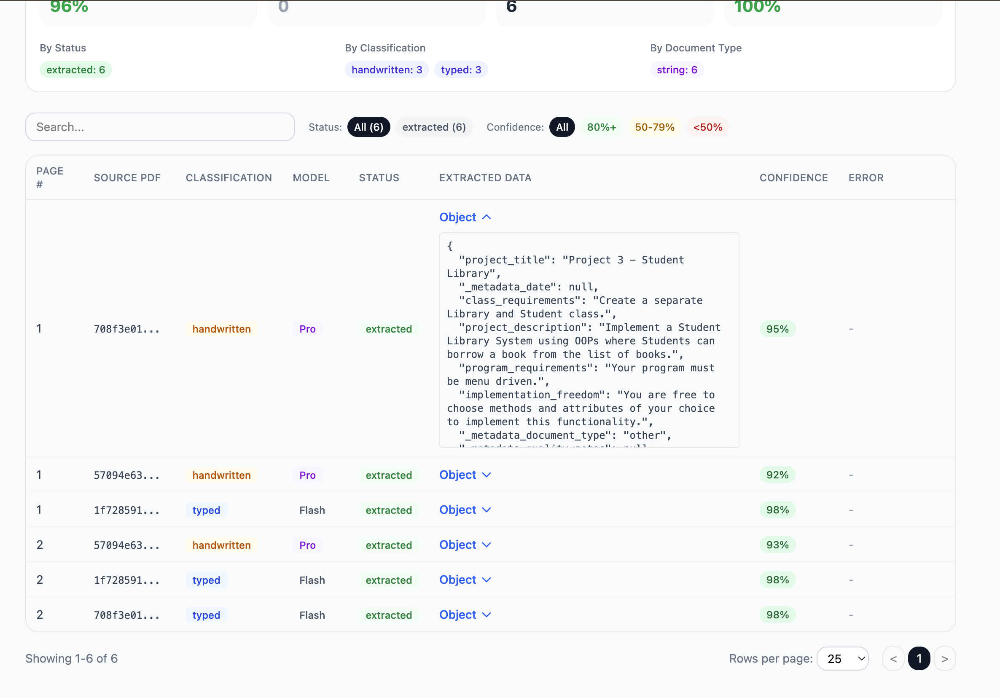
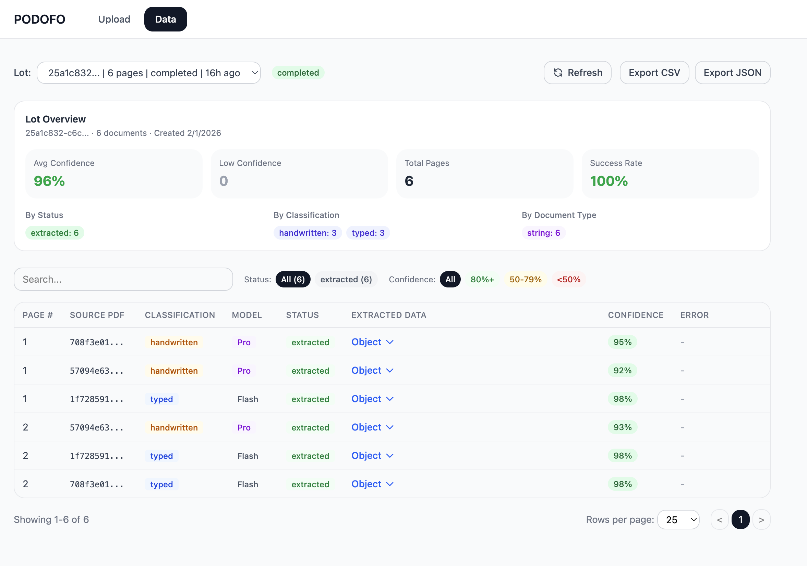
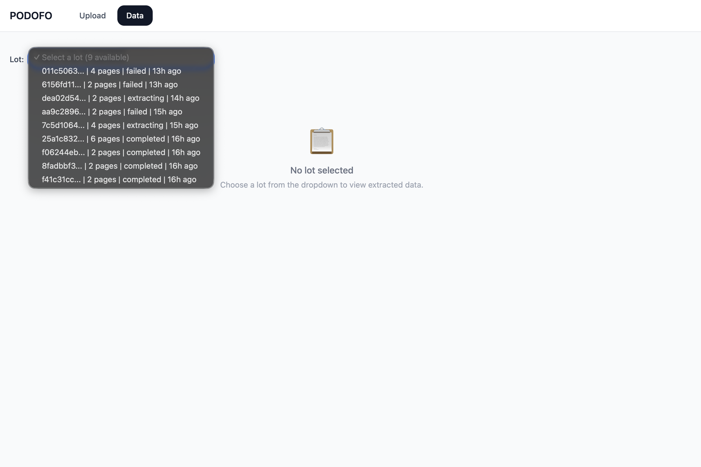
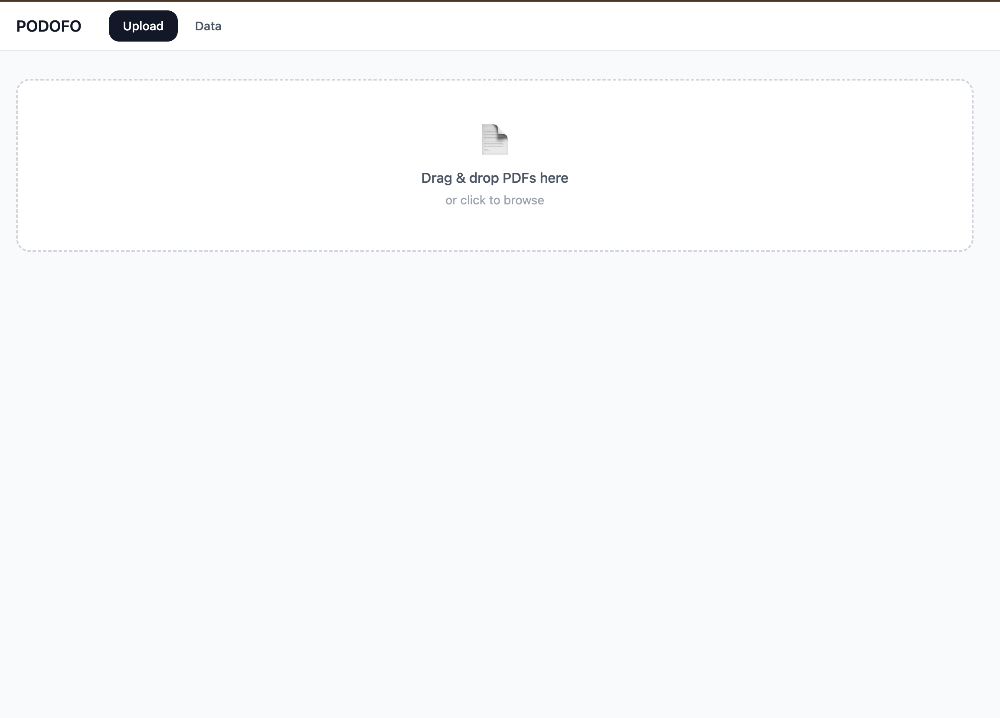

# PODOFO - Intelligent PDF Data Extractor

An AI-powered system that processes PDF documents through intelligent classification and data extraction using Google Gemini models, with smart model routing and cost optimization via the Batch API.

**Live Demo:** [https://podofo.netlify.app]
**Backend API:** [https://internal-corabel-syazah-aeb3f9df.koyeb.app/]

---

## Table of Contents

- [Architecture Overview](#architecture-overview)
- [Tech Stack & Design Decisions](#tech-stack--design-decisions)
- [Features](#features)
- [System Design](#system-design)
- [Cost Optimization Strategy](#cost-optimization-strategy)
- [Extraction Accuracy & Quality](#extraction-accuracy--quality)
- [API Documentation](#api-documentation)
- [Database Schema](#database-schema)
- [Setup & Installation](#setup--installation)
- [Deployment](#deployment)
- [Screenshots](#screenshots)
- [Technical Write-Up](#technical-write-up)

---

## Architecture Overview

```
                                    +------------------+
                                    |   React Frontend |
                                    |  (Netlify/Vite)  |
                                    +--------+---------+
                                             |
                                             | REST API
                                             v
+----------+    +-------------------+    +---+---------------+    +-----------+
|  Multer  +--->|  Express.js API   +--->|  BullMQ Queues    +--->| Gemini AI |
| (Upload) |    |  (Node.js/TS)     |    |  (Redis-backed)   |    | API       |
+----------+    +--------+----------+    +---+---+---+-------+    +-----------+
                         |                   |   |   |
                         v                   v   v   v
                  +------+------+    +-------+---+---+-------+
                  |  Supabase   |    | Classification | Batch |
                  |  Storage    |    | Worker   | Extraction  |
                  |  (S3)       |    |          | Worker      |
                  +------+------+    +----------+-------------+
                         |
                         v
                  +------+------+
                  |  Supabase   |
                  |  PostgreSQL |
                  +-------------+
```

### Processing Pipeline

```
PDF Upload → Page Splitting (MuPDF @ 300 DPI)
           → Image Preprocessing (Sharp: rotate, denoise, contrast, JPEG compress)
           → Upload to Supabase Storage
           → Classification (Gemini Flash: handwritten/typed/mixed)
           → Smart Model Routing (handwritten → Pro, typed → Flash)
           → Data Extraction (Gemini Pro or Flash based on classification)
           → Results stored in PostgreSQL
           → Frontend displays with real-time polling
```

---

## Tech Stack & Design Decisions

### Backend

| Technology | Purpose | Why This Choice |
|---|---|---|
| **Node.js + TypeScript** | Runtime & language | Type safety for complex data flows, good async I/O for API-heavy workloads |
| **Express.js v5** | HTTP framework | Lightweight, minimal overhead, well-suited for REST APIs |
| **BullMQ** | Job queue | Reliable Redis-backed queues with retry logic, concurrency control, and delayed jobs for batch polling |
| **MuPDF (via mupdf)** | PDF rendering | High-fidelity page-to-image rendering at configurable DPI; faster and more accurate than alternatives like pdf-lib |
| **Sharp** | Image processing | Native libvips bindings for fast preprocessing: auto-rotation, noise reduction, contrast enhancement, JPEG compression with mozjpeg |
| **Google Gemini API** | AI classification & extraction | Multimodal vision capabilities for document understanding; supports both standard and Batch API for cost optimization |
| **Supabase** | Database + Storage | PostgreSQL for structured data, S3-compatible storage for PDFs and images, single platform for both |
| **Redis (Upstash)** | Queue backend | Cloud-hosted Redis with TLS for BullMQ job queues; required for reliable async job processing |
| **Winston** | Logging | Structured logging with separate info/error log files for debugging production issues |

### Frontend

| Technology | Purpose | Why This Choice |
|---|---|---|
| **React 19** | UI framework | Component-based architecture, hooks for state management |
| **Vite** | Build tool | Fast HMR in development, optimized production builds |
| **TailwindCSS v4** | Styling | Utility-first CSS for rapid UI development without custom CSS files |
| **TanStack React Table** | Data table | Headless table with sorting, filtering, pagination built-in |
| **React Router v7** | Routing | Client-side navigation between upload and data views |

### Infrastructure

| Service | Purpose |
|---|---|
| **Koyeb** | Backend hosting (Node.js server + BullMQ workers) |
| **Netlify** | Frontend hosting (React SPA with SPA redirect rules) |
| **Supabase** | PostgreSQL database + S3-compatible object storage |
| **Upstash** | Managed Redis for BullMQ job queues (TLS-enabled) |

---

## Features

### Core Features
- **Multi-PDF Upload**: Upload multiple PDFs simultaneously; each PDF is split into individual pages
- **Image Preprocessing Pipeline**: Auto-rotation, noise reduction, contrast enhancement, JPEG compression (85% quality, mozjpeg)
- **AI Classification**: Documents classified as `handwritten`, `typed`, or `mixed` with confidence scores
- **Smart Model Routing**: Handwritten/mixed documents routed to Gemini 2.5 Pro; typed documents to Gemini 2.5 Flash
- **Data Extraction**: Structured data extracted from each page with confidence scoring
- **Batch API Integration**: Documents over the threshold (10+) automatically use Gemini Batch API for ~50% cost savings
- **Export**: Download extracted data as CSV or JSON

### Frontend Features
- **Real-time Progress Tracking**: 1.5s polling with live status updates
- **Stage Pipeline Visualization**: Visual progress through Classify → Extract → Done stages
- **Dual Progress Bars**: Separate classification and extraction progress indicators
- **Per-Document Detail View**: Expandable table showing each document's status, classification, model, and confidence
- **Data Filtering**: Filter by status (extracted/classified/failed/pending) and confidence range (high/medium/low)
- **Lot Statistics Panel**: Average confidence, success rate, breakdowns by status/classification/document type
- **Sortable Data Table**: Column sorting, global search, paginated results
- **Expandable Cells**: Click to expand truncated extracted data, arrays, and objects
- **Data Export**: One-click CSV/JSON download

---

## System Design

### Queue Architecture

The system uses three BullMQ queues backed by Redis:

1. **Classification Queue** (`document-classification`): Processes document classification in batches. Used for lots under the batch API threshold.

2. **Extraction Queue** (`document-extraction`): Processes data extraction after classification. Groups documents by assigned model for smart routing.

3. **Batch Processing Queue** (`batch-processing`): Handles Gemini Batch API submissions and polling for larger lots. Two job types:
   - `submit-*`: Submits batch jobs to Gemini
   - `poll`: Polls Gemini for batch completion with configurable delay (30s)

### Processing Modes

| Lot Size | Classification | Extraction |
|---|---|---|
| **1-10 documents** | Standard API (real-time) | Standard API (real-time) |
| **10+ documents** | Batch API (~50% savings) | Batch API (~50% savings) |

### Smart Model Routing

After classification, each document is assigned an extraction model:

| Classification | Assigned Model | Rationale |
|---|---|---|
| `typed` | Gemini 2.5 Flash | Printed text is straightforward; Flash is faster and cheaper |
| `handwritten` | Gemini 2.5 Pro | Handwriting requires stronger vision capabilities |
| `mixed` | Gemini 2.5 Pro | Mixed content benefits from Pro's enhanced understanding |

### Error Handling & Recovery

- Failed documents are individually marked with error messages, allowing partial lot completion
- Lot-level status reflects overall outcome: `completed`, `partial_failure`, or `failed`
- BullMQ provides automatic retry for transient failures
- All failure paths in batch processing properly update document status in the database

---

## Cost Optimization Strategy

### 1. Batch API for Volume Processing
- Documents exceeding the threshold (configurable, default: 10) are processed via Gemini's Batch API
- Batch API provides **~50% cost reduction** compared to standard API calls
- Trade-off: Higher latency (async polling at 30s intervals) vs. significant cost savings

### 2. Smart Model Routing
- Only handwritten/mixed documents use the more expensive Gemini Pro model
- Typed documents (often the majority) use the cheaper Gemini Flash model
- Classification itself always uses Flash since it's a simpler visual task

### 3. Image Optimization
- PDF pages rendered at 300 DPI (configurable) - high enough for OCR accuracy, not wastefully large
- Images compressed to JPEG at 85% quality with mozjpeg (5-10x size reduction vs raw PNG)
- Max dimensions capped at 2000x2800px to reduce API input token costs
- Preprocessing (rotation, denoise, contrast) improves extraction quality, reducing need for re-processing

### 4. Batched Classification
- Documents are sent to Gemini in groups (up to 25 per request for standard API) rather than one-by-one
- Reduces API call overhead and total request count

### Image Preprocessing Pipeline

Each PDF page goes through four preprocessing steps before AI processing:

1. **Auto-Rotation** (`sharp.rotate()`): Corrects orientation using EXIF data
2. **Noise Reduction** (`sharp.median(3)`): 3x3 median filter removes salt-and-pepper noise
3. **Contrast Enhancement** (`sharp.normalize()`): Stretches histogram to full range for better text visibility
4. **JPEG Compression** (`sharp.jpeg({ quality: 85, mozjpeg: true })`): Reduces file size while maintaining quality

### Classification Prompt Engineering

The classification prompt includes:
- Detailed category definitions with examples for each classification type
- Decision rules for edge cases (signatures vs. handwriting, annotations, poor quality images)
- Confidence scoring guidelines with explicit ranges (0.90-1.00 = very clear, 0.70-0.89 = minor ambiguity, 0.50-0.69 = noticeable uncertainty)

### Extraction Approach

- Documents are processed with their classification context for model routing
- Extraction handles multiple document types: invoices, receipts, forms, letters, contracts, reports, tables
- Handwritten text flagged with `[uncertain]` markers when unclear
- Structured output with document type identification

### Confidence Scoring

- **Classification confidence**: 0-1 scale from Gemini, indicating certainty of handwritten/typed/mixed classification
- **Extraction confidence**: Overall confidence score for extracted data quality
- **Field-level confidences**: Per-field confidence scores stored for granular quality assessment
- Frontend displays color-coded badges: green (80%+), yellow (50-79%), red (<50%)

---

## API Documentation

### Endpoints

#### Upload PDFs
```
POST /api/v1/upload/pdfs
Content-Type: multipart/form-data

Body: pdfs[] (multiple PDF files)

Response 201:
{
  "lot_id": "uuid",
  "status": "classifying",
  "total": 15,
  "uploaded": 15,
  "failed": 0,
  "documents": [
    { "id": "uuid", "source_pdf_id": "uuid", "page_number": 1, "storage_path": "...", "file_size": 12345 }
  ],
  "errors": []
}
```

#### Get Lot Status (with progress)
```
GET /api/v1/lot/:id/status

Response 200:
{
  "lotId": "uuid",
  "status": "extracting",
  "progress": { "total": 15, "classified": 15, "extracted": 8, "failed": 0 },
  "documents": [
    { "id": "uuid", "status": "extracted", "page_number": 1, "classification": "typed", "confidence": 0.92, "assigned_model": "gemini-2.5-flash" }
  ]
}
```

#### List All Lots
```
GET /api/v1/lots

Response 200:
[
  { "id": "uuid", "total_files": 15, "status": "completed", "created_at": "2025-01-15T..." }
]
```

#### Get Lot Documents (paginated)
```
GET /api/v1/lot/:id/documents?page=1&limit=25

Response 200:
{
  "documents": [
    {
      "id": "uuid",
      "lot_id": "uuid",
      "source_pdf_id": "uuid",
      "page_number": 1,
      "status": "extracted",
      "classification": "typed",
      "assigned_model": "gemini-2.5-flash",
      "extracted_data": { ... },
      "confidence": 0.92,
      "field_confidences": { ... },
      "error_message": null
    }
  ],
  "total": 15,
  "page": 1,
  "limit": 25
}
```

#### Export Lot Data
```
GET /api/v1/lot/:id/export/json   → Downloads JSON file
GET /api/v1/lot/:id/export/csv    → Downloads CSV file
```

#### Health Check
```
GET /health

Response 200: { "status": "ok" }
```

---

## Database Schema

### Lots
| Column | Type | Description |
|---|---|---|
| id | UUID (PK) | Lot identifier |
| status | TEXT | uploading, classifying, extracting, completed, failed, partial_failure |
| total_files | INTEGER | Total number of document pages |
| processed_ids | TEXT[] | Array of successfully processed document IDs |
| failed_ids | TEXT[] | Array of failed document IDs |
| created_at | TIMESTAMPTZ | Creation timestamp |
| updated_at | TIMESTAMPTZ | Last update timestamp |

### Source PDFs
| Column | Type | Description |
|---|---|---|
| id | UUID (PK) | Source PDF identifier |
| lot_id | UUID (FK) | Parent lot reference |
| original_filename | TEXT | Original uploaded filename |
| storage_path | TEXT | S3 path to original PDF |
| file_size | INTEGER | File size in bytes |
| file_hash | TEXT | SHA-256 hash of original file |
| page_count | INTEGER | Number of pages in PDF |
| created_at | TIMESTAMPTZ | Upload timestamp |

### Documents
| Column | Type | Description |
|---|---|---|
| id | UUID (PK) | Document (page) identifier |
| lot_id | UUID (FK) | Parent lot reference |
| source_pdf_id | UUID (FK) | Source PDF reference |
| storage_path | TEXT | S3 path to processed JPEG image |
| file_size | INTEGER | Processed image size in bytes |
| file_hash | TEXT | SHA-256 hash of processed image |
| page_number | INTEGER | Page number within source PDF |
| status | TEXT | pending, classified, extracted, failed |
| classification | TEXT | handwritten, typed, mixed |
| assigned_model | TEXT | Gemini model used for extraction |
| extracted_data | JSONB | Extracted fields and metadata |
| confidence | FLOAT | Overall extraction confidence (0-1) |
| field_confidences | JSONB | Per-field confidence scores |
| error_message | TEXT | Error description if failed |
| created_at | TIMESTAMPTZ | Creation timestamp |
| updated_at | TIMESTAMPTZ | Last update timestamp |

---

## Setup & Installation

### Prerequisites
- Node.js 18+
- Redis (local for development, or Upstash for production)
- Supabase account (for database + storage)
- Google Gemini API key

### 1. Clone the Repository
```bash
git clone <!-- ADD YOUR REPO URL -->
cd podofo
```

### 2. Backend Setup
```bash
# Install dependencies
npm install

# Create .env file
cp .env.example .env
```

Edit `.env` with your credentials:
```env
PORT=4444

# Google Gemini
GEMINI_API_KEY=your_gemini_api_key

# Supabase
SUPABASE_PROJECT_URL=https://your-project.supabase.co
SUPABASE_ANON_KEY=your_anon_key
SUPABASE_SERVICE_KEY=your_service_key

# Redis (local development)
REDIS_HOST=localhost
REDIS_PORT=6379

# Redis (production - Upstash)
# REDIS_HOST=your-redis.upstash.io
# REDIS_PORT=6379
# REDIS_USERNAME=default
# REDIS_PASSWORD=your_password
# REDIS_TLS=true
```

```bash
# Start backend in development mode
npm run dev
```

### 3. Frontend Setup
```bash
cd client

# Install dependencies
npm install

# Create .env for production (optional - dev uses Vite proxy)
# echo "VITE_API_URL=http://localhost:4444/api/v1" > .env

# Start frontend
npm run dev
```

### 4. Supabase Setup

Create the following tables in your Supabase SQL editor:

```sql
-- Lots table
CREATE TABLE lots (
  id UUID DEFAULT gen_random_uuid() PRIMARY KEY,
  status TEXT NOT NULL DEFAULT 'uploading',
  total_files INTEGER NOT NULL DEFAULT 0,
  processed_ids TEXT[] DEFAULT '{}',
  failed_ids TEXT[] DEFAULT '{}',
  created_at TIMESTAMPTZ DEFAULT NOW(),
  updated_at TIMESTAMPTZ DEFAULT NOW()
);

-- Source PDFs table
CREATE TABLE source_pdfs (
  id UUID DEFAULT gen_random_uuid() PRIMARY KEY,
  lot_id UUID REFERENCES lots(id) ON DELETE CASCADE,
  original_filename TEXT NOT NULL,
  storage_path TEXT NOT NULL,
  file_size INTEGER NOT NULL,
  file_hash TEXT NOT NULL,
  page_count INTEGER NOT NULL DEFAULT 0,
  created_at TIMESTAMPTZ DEFAULT NOW()
);

-- Documents table
CREATE TABLE documents (
  id UUID DEFAULT gen_random_uuid() PRIMARY KEY,
  lot_id UUID REFERENCES lots(id) ON DELETE CASCADE,
  source_pdf_id UUID REFERENCES source_pdfs(id) ON DELETE CASCADE,
  storage_path TEXT,
  file_size INTEGER,
  file_hash TEXT,
  page_number INTEGER NOT NULL,
  status TEXT NOT NULL DEFAULT 'pending',
  classification TEXT,
  assigned_model TEXT,
  extracted_data JSONB,
  confidence FLOAT,
  field_confidences JSONB,
  error_message TEXT,
  created_at TIMESTAMPTZ DEFAULT NOW(),
  updated_at TIMESTAMPTZ DEFAULT NOW()
);
```

Create a storage bucket named `pdfs` in Supabase Storage.

### 5. Redis Setup (Local Development)
```bash
# macOS
brew install redis
brew services start redis

# Or using Docker
docker run -d --name redis -p 6379:6379 redis
```

---

## Deployment

### Backend (Koyeb)

1. Push code to GitHub
2. Connect repository to Koyeb
3. Set build command: `npm install && npm run build`
4. Set run command: `node dist/index.js`
5. Configure environment variables (all from `.env`)
6. Ensure `REDIS_TLS=true` for Upstash

### Frontend (Netlify)

1. Connect `client/` directory to Netlify
2. Build command: `npm run build`
3. Publish directory: `dist`
4. Set environment variable: `VITE_API_URL=https://your-backend.koyeb.app/api/v1`

The `client/netlify.toml` handles SPA redirect rules automatically.

---

## Screenshots






## Project Structure

```
podofo/
├── src/                          # Backend source
│   ├── index.ts                  # Express server entry point
│   ├── routes.ts                 # API route definitions
│   ├── config/                   # Configuration
│   │   ├── constants.ts          # App constants (DPI, batch sizes, models)
│   │   ├── logger.ts             # Winston logging setup
│   │   ├── HttpError.ts          # Custom error class
│   │   ├── gemini/client.ts      # Gemini API client
│   │   ├── multer/config.ts      # File upload config
│   │   ├── redis/connection.ts   # Redis connection (TLS support)
│   │   └── supabase/client.ts    # Supabase client
│   ├── controller/               # HTTP request handlers
│   │   └── file.controller.ts    # Upload, status, export endpoints
│   ├── service/                  # Business logic
│   │   ├── upload.service.ts     # PDF processing & page splitting
│   │   ├── classifier.service.ts # Document classification
│   │   ├── extraction.service.ts # Data extraction
│   │   ├── batch.service.ts      # Gemini Batch API integration
│   │   ├── preprocess.service.ts # Image preprocessing pipeline
│   │   └── ai.service.ts         # Gemini API wrapper
│   ├── queue/                    # BullMQ queues
│   │   ├── producer/             # Job enqueuers
│   │   └── worker/               # Job processors
│   ├── data/                     # Database access layer
│   │   ├── lot.data.ts           # Lot CRUD operations
│   │   ├── document.data.ts      # Document CRUD operations
│   │   ├── source_pdf.data.ts    # Source PDF metadata
│   │   └── storage.data.ts       # S3/Supabase storage operations
│   ├── types/                    # TypeScript type definitions
│   └── prompts/                  # AI prompt templates
│       ├── classificationPrompts.ts
│       └── extractionPrompt.ts
├── client/                       # React frontend
│   ├── src/
│   │   ├── api/client.ts         # API fetch functions
│   │   ├── hooks/                # Custom React hooks
│   │   ├── pages/                # Page components
│   │   ├── components/           # UI components
│   │   └── types/                # Frontend type definitions
│   ├── netlify.toml              # Netlify deployment config
│   └── vite.config.ts            # Vite build config
├── ecosystem.config.cjs          # PM2 production config
└── package.json
```

---

## Technical Write-Up

- What was the hardest part?
  The hardest path was using batch APIs of Gemini and handling various queues, designing the flow of data was critical.

- How did you improve extraction accuracy?
  By iterating over the prompts and playing with the various parameters for preprocessing, it was made possible for the extraction accuracy.

- What did you learn?
  I learnt to build a complex application in a short period of time which can handle a lot of load and talk with LLM, designing a system which handles a lot of data to and fro was pretty complex and this whole project was a good learning practice.

- How did you use AI while building this?
  I used AI to build major parts of frontend, and writing some basic boilerplate code, even writing the basic structure of this Readme.

### Approach & Methodology
The system was designed around a pipeline architecture where each stage (upload, classification, extraction) operates independently through job queues. This decoupling provides several benefits:

1. **Resilience**: If extraction fails for one document, it doesn't affect others in the lot
2. **Scalability**: Each stage can be scaled independently by adding more workers
3. **Cost Efficiency**: The batch vs. standard API decision happens at upload time based on lot size

### Key Design Decisions

**Why BullMQ over alternatives?**
BullMQ provides reliable, Redis-backed job queues with built-in retry logic, delayed jobs (used for batch polling), and concurrency control. This is essential for the async Gemini Batch API workflow where jobs need to be polled at intervals until completion. We could have used Kafka as well but to keep it an MVP we are using bullMQ

**Why MuPDF for PDF rendering?**
MuPDF provides high-fidelity PDF page rendering at configurable DPI. Rendering at 300 DPI produces images suitable for OCR while keeping file sizes manageable after JPEG compression. The alternative (pdf-lib) doesn't support page-to-image rendering. I faced an issue where pdf-lib was not able to decrypt the pdf, and thus we were storing blank pages, thus I used muPDF.

**Why Supabase for both database and storage?**
Using a single platform for PostgreSQL and S3-compatible storage simplifies the architecture, reduces the number of external service dependencies, and provides a unified authentication model.

**Why separate classification and extraction stages?**
Classification determines the optimal extraction model. Handwritten documents genuinely benefit from the more capable (and expensive) Pro model, while typed documents are handled efficiently by Flash. This two-stage approach enables cost-aware model routing.

### Challenges & Solutions
1. **Challenge**: Encrypted PDFs not being parsed by pdf-lib
   **Solution**: Move to muPDF, it allowed the parsing of encrypted pdfs

2. **Challenge**: Storing Images
   **Solution**: Compressing the images and then storing reduce the time, and improved the speed of execution

3. **Challenge**: Duplicate Files?
   **Solution**: Using File Hashes.


### Assumptions & Trade-offs

- **Polling over WebSockets**: The frontend polls for status updates (1.5s interval) rather than using WebSockets. This is simpler to implement and deploy (no sticky sessions needed), with acceptable latency for a document processing use case.
- **Single-worker concurrency**: The system runs with limited concurrency (3 concurrent batch jobs). This prevents rate limiting from the Gemini API while still processing multiple documents in parallel.
- **Page-level granularity**: Each PDF page is processed as an independent document. This enables per-page classification and model routing but means cross-page context (like multi-page tables) is not preserved.

### Future Improvements

- **WebSocket real-time updates**: Replace polling with WebSocket connections for instant status updates
- **Authentication**: Add user authentication and per-user lot management
- **Retry UI**: Allow users to retry failed documents from the frontend
- **Template system**: Define extraction templates for specific document types (invoices, receipts, etc.)
